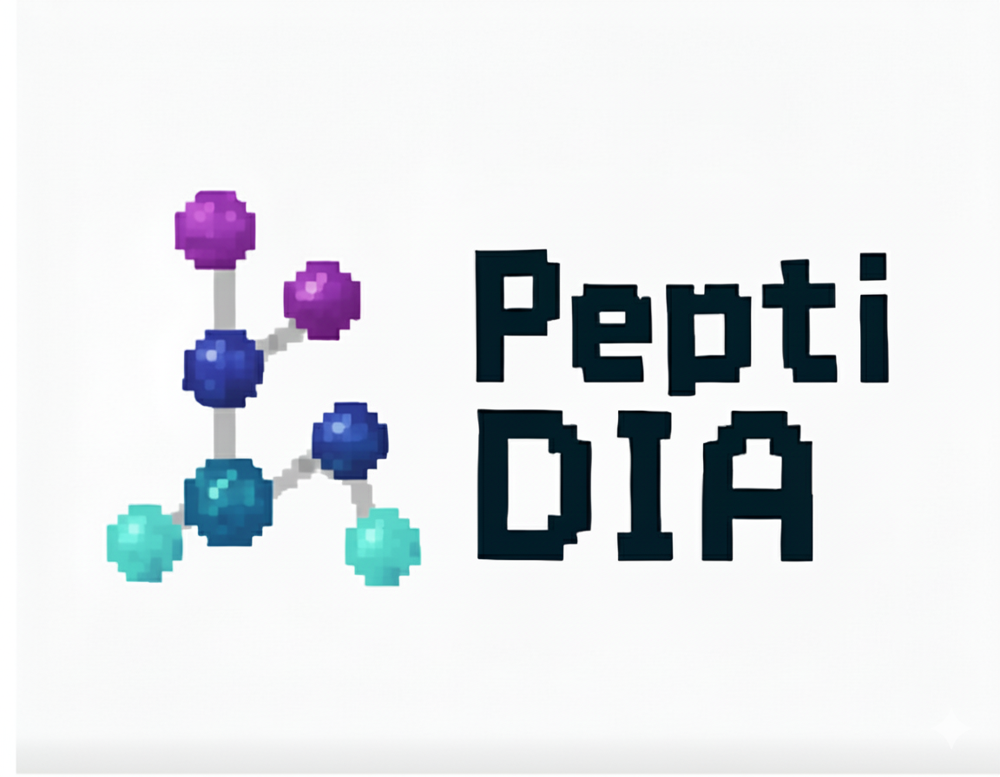

<div align="center">
  
  
  # PeptiDIA
  **Find More Peptides in Your Data** 🧬
</div>

## What is PeptiDIA?

PeptiDIA helps scientists find **MORE peptides** in their DIA-NN mass spectrometry analyzed data using machine learning.

- 📊 **Web interface** - No coding required !
- 🤖 **AI-powered** - Finds additional peptides at low error rates
- 🔬 **Easy to use** - Upload data, get results

## Quick Start (3 steps!)

📋 **For detailed installation instructions, see [docs/PEPTIDIA_FULL_GUIDE.md](docs/PEPTIDIA_FULL_GUIDE.md)**

### Step 1: Get PeptiDIA & Install
```bash
git clone https://github.com/Jordano700/PeptiDIA.git
cd PeptiDIA
python scripts/install.py
```

### Step 2: Add Your DIA-NN Data
Put your DIA-NN analyzed `.parquet` files in the `data/` folder with these **specific FDR levels**:
```
data/
  YourDataset/
    short_gradient/
      FDR_1/          # DIA-NN results at 1% FDR
        your_file.parquet
      FDR_20/         # DIA-NN results at 20% FDR  
        your_file.parquet
      FDR_50/         # DIA-NN results at 50% FDR
        your_file.parquet
    long_gradient/  
      FDR_1/          # DIA-NN results at 1% FDR only
        your_file.parquet
```

**Important:** 
- Data must be from **DIA-NN analysis** with FDR filtering set at these exact levels
- Short gradient needs: **1%, 20%, and 50% FDR** results
- Long gradient needs: **1% FDR** results only

### Step 3: Run PeptiDIA

**Windows:**
```batch
start_peptidia.bat
```

**Mac/Linux:**
```bash
./start_peptidia.sh
```

Opens automatically at `http://localhost:8501`

## Interface Modes 🎛️

PeptiDIA has **3 simple modes** to guide you through the process:

### 1. 🔧 **Setup Mode**
- Configure your datasets very easily
- Set up ground truth matching

### 2. 🎯 **Training Mode** 
- AI learns from your data
- Shows training progress and results 

### 3. 🚀 **Inference Mode**
- Apply trained models to find new peptides
- Get results instantly
- Download your discoveries

## That's it! 🎉

The interface walks you through each step - no guessing needed!

## Command Line Interface (CLI) 💻

For advanced users, PeptiDIA also provides a command-line interface:

```bash
./scripts/run_cli.sh
```

**⚠️ Note:** While the CLI is available, **we strongly recommend using the Streamlit web interface** for the full PeptiDIA experience:
- 📊 **Interactive visualizations** - See your results in real-time
- 🎛️ **Easy hyperparameter tuning** - Adjust settings with sliders and dropdowns
- 🧭 **Guided navigation** - Step-by-step workflow
- 🎯 **Better usability** - No command-line complexity

The web interface provides all functionality with a much more intuitive experience!

## License
This project is licensed under the MIT License – see the [LICENSE](LICENSE) file for details.

## Citation
If you use PeptiDIA in your research, please cite this work:

```
Ortona, J. (2025). PeptiDIA: Machine Learning-Enhanced Peptide Discovery in DIA-NN Data. 
GitHub repository: https://github.com/Jordano700/PeptiDIA
```

BibTeX format:
```bibtex
@software{ortona2025peptidia,
  author = {Ortona, Jordan},
  title = {PeptiDIA: Machine Learning-Enhanced Peptide Discovery in DIA-NN Data},
  year = {2025},
  url = {https://github.com/Jordano700/PeptiDIA},
  note = {Software for finding additional peptides in mass spectrometry data using AI}
}
```

## Need Help?

- 🐛 Report issues on GitHub
- 💡 Questions? Open an issue!