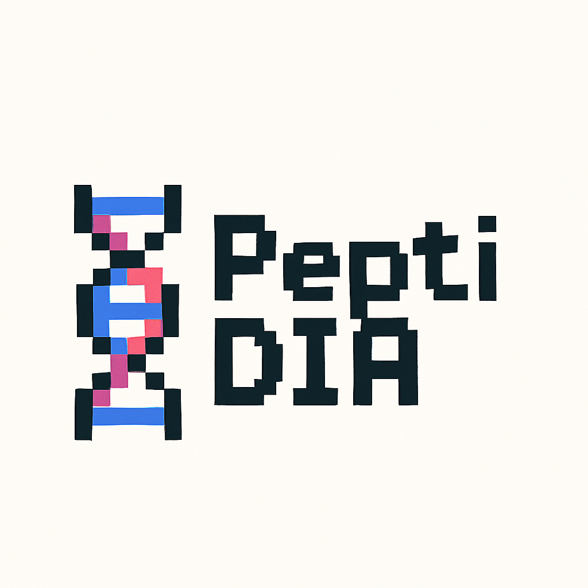

<div align="center">
  
  
  # PeptiDIA
  **Find More Proteins in Your Data** 🧬
</div>

## What is PeptiDIA?

PeptiDIA helps scientists find **MORE proteins** in their mass spectrometry data using machine learning.

- 📊 **Web interface** - No coding required!
- 🤖 **AI-powered** - Finds proteins others miss
- 🔬 **Easy to use** - Upload data, get results

## Quick Start (3 steps!)

### Step 1: Get PeptiDIA
```bash
git clone https://github.com/Jordano700/PeptiDIA.git
cd PeptiDIA
pip install -r requirements.txt
```

### Step 2: Add Your Data
Put your `.parquet` files in the `data/` folder like this:
```
data/
  YourDataset/
    short_gradient/
      FDR_1/
        your_file.parquet
    long_gradient/  
      FDR_1/
        your_file.parquet
```

### Step 3: Run PeptiDIA
```bash
./run_streamlit.sh
```
Then open your web browser to `http://localhost:8501` 

## That's it! 🎉

PeptiDIA will:
1. Load your data automatically
2. Train AI models 
3. Find extra proteins
4. Show you the results

## Need Help?

- 📚 Check `CLAUDE.md` for detailed info
- 🐛 Report issues on GitHub
- 💡 Questions? Open an issue!

---

**Made for scientists, by scientists** ❤️