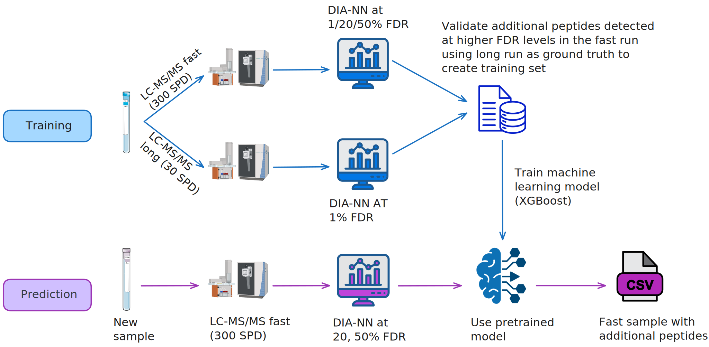

<div align="center">
  

  # PeptiDIA
  **Find More Peptides in Your Data**
</div>

## What is PeptiDIA?

PeptiDIA is a machine-learning framework that recovers additional peptides from fast-gradient DIA-NN data, increasing proteome depth with controlled reference-discordance rates and no changes to acquisition settings. It runs as a guided web app (and command-line tool).

## How it works

<div align="center">
  
</div>

PeptiDIA uses **paired fast- and long-gradient acquisitions** of the same samples. Fast-gradient runs (high throughput) are searched in DIA-NN at relaxed FDR (20% / 50%) to expose a large candidate pool, while the matched long-gradient run (1% FDR) provides high-confidence **ground-truth labels**. An **XGBoost** classifier (87 DIA-NN and engineered features, with isotonic-calibrated probabilities) then recovers true peptides from new fast-gradient data at a user-controlled **reference-discordance rate (RDR)**.

## Quick Start (3 steps)

📋 **For detailed instructions, see the [full PeptiDIA guide](docs/PEPTIDIA_FULL_GUIDE.md)**

### Option A: Docker (zero setup, recommended)

No Python needed, just [Docker](https://docs.docker.com/get-docker/):

```bash
git clone https://github.com/Jordano700/PeptiDIA.git
cd PeptiDIA
./run-docker.sh
```

**GPU (optional):** `docker compose -f docker-compose.yml -f docker-compose.gpu.yml up`

### Option B: Native install

### Step 1: Get PeptiDIA & Install
```bash
git clone https://github.com/Jordano700/PeptiDIA.git
cd PeptiDIA
python scripts/install.py
```

### Step 2: Add Your DIA-NN Data
Launch the app (Step 3), open **Setup Mode**, and drag-and-drop your DIA-NN analyzed `.parquet` files. The app names, organizes, and stores the dataset for you.

You provide DIA-NN results for:
- **Short gradient** at 1%, 20%, and 50% FDR
- **Long gradient** at 1% FDR (used as ground truth)

### Step 3: Run PeptiDIA

**Windows:**
```powershell
# PowerShell (recommended)
./start_peptidia.bat

# Command Prompt (CMD)
start_peptidia.bat
```

**Mac/Linux:**
```bash
./start_peptidia.sh
```

Opens automatically at `http://localhost:8501`

## Interface Modes 🎛️

| Mode | What it does |
|------|--------------|
| 🔧 **Setup** | Add datasets: drag-and-drop your DIA-NN `.parquet` files and set up ground-truth matching |
| 🎯 **Training** | Train a model on your data; results auto-save (table, feature importance, SHAP) |
| 🚀 **Inference** | Recover peptides at your chosen RDR with the bundled **PeptiDIA Pre-trained (cross-tissue)** model or one you trained |


## Command Line Interface (CLI) 💻

For advanced users, PeptiDIA also provides a command-line interface:

```bash
./scripts/run_cli.sh
```

**⚠️ Note:** While the CLI is available, **we strongly recommend using the Streamlit web interface** for the full PeptiDIA experience:
- 📊 **Interactive visualizations** - See your results in real-time
- 🎛️ **Easy hyperparameter tuning** - Adjust settings with sliders and dropdowns
- 🧭 **Guided navigation** - Step-by-step workflow
- 🎯 **Better usability** - No command-line complexity

The web interface provides all functionality with a much more intuitive experience.

## Data Availability
The mass spectrometry proteomics data (six human and murine tissues) are deposited in the MassIVE repository under accession **MSV000102018**. The source code and the pre-trained cross-tissue model are available in this repository.

## License
This project is licensed under the MIT License – see the [LICENSE](LICENSE) file for details.

## Citation
If you use PeptiDIA in your research, please cite this work:

```
Ortona, J., Leclercq, M., Roux-Dalvai, F., & Droit, A. (2026). PeptiDIA: A Machine Learning Framework for Enhanced Peptide Identification in Fast-Gradient Data-Independent Acquisition Proteomics. https://github.com/Jordano700/PeptiDIA
```

BibTeX format:
```bibtex
@software{ortona2026peptidia,
  author = {Ortona, Jordan and Leclercq, Micka{\"e}l and Roux-Dalvai, Florence and Droit, Arnaud},
  title  = {PeptiDIA: A Machine Learning Framework for Enhanced Peptide Identification in Fast-Gradient Data-Independent Acquisition Proteomics},
  year   = {2026},
  url    = {https://github.com/Jordano700/PeptiDIA},
  note   = {Software for recovering additional peptides in fast-gradient DIA-NN data using machine learning}
}
```

## Need Help?

- 🐛 Report issues on GitHub
- 💡 Questions? Open an issue

---
<sub>PeptiDIA v1.0</sub>

