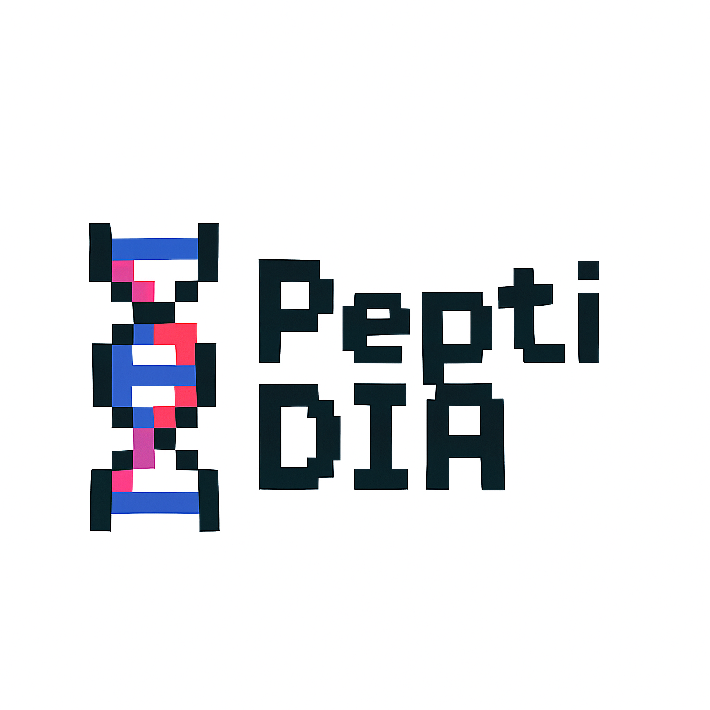

<div align="center">
  
  
  # PeptiDIA
  **Find More Peptides in Your Data** 🧬
</div>

## What is PeptiDIA?

PeptiDIA helps scientists find **MORE peptides** in their DIA-NN mass spectrometry analyzed data using machine learning.

- 📊 **Web interface** - No coding required !
- 🤖 **AI-powered** - Finds additional peptides at low error rates
- 🔬 **Easy to use** - Upload data, get results

## Quick Start (3 steps!)

### Step 1: Get PeptiDIA & Install
```bash
git clone https://github.com/Jordano700/PeptiDIA.git
cd PeptiDIA
python install.py
```

**That's it!** The installer:
- ✅ Checks your Python version (3.8+ required)
- ✅ Creates an isolated virtual environment 
- ✅ Installs exact tested versions that work together
- ✅ Tests the installation
- ✅ Sets up launcher scripts for all tools

*Works on Windows, Mac, and Linux with any Python 3.8+*

### Step 2: Add Your DIA-NN Data
Put your DIA-NN analyzed `.parquet` files in the `data/` folder with these **specific FDR levels**:
```
data/
  YourDataset/
    short_gradient/
      FDR_1/          # DIA-NN results at 1% FDR
        your_file.parquet
      FDR_20/         # DIA-NN results at 20% FDR  
        your_file.parquet
      FDR_50/         # DIA-NN results at 50% FDR
        your_file.parquet
    long_gradient/  
      FDR_1/          # DIA-NN results at 1% FDR only
        your_file.parquet
```

**Important:** 
- Data must be from **DIA-NN analysis** with FDR filtering set at these exact levels
- Short gradient needs: **1%, 20%, and 50% FDR** results
- Long gradient needs: **1% FDR** results only

### Step 3: Run PeptiDIA

**Web Interface (Recommended):**
```bash
./run_streamlit.sh
```

**Command Line Interface:**
```bash
./run_cli.sh
```

**Performance Comparison:**
```bash
./run_comparison.sh
```

Then open your web browser to `http://localhost:8501` for the web interface.

## Interface Modes 🎛️

PeptiDIA has **3 simple modes** to guide you through the process:

### 1. 🔧 **Setup Mode**
- Configure your datasets very easily
- Set up ground truth matching

### 2. 🎯 **Training Mode** 
- AI learns from your data
- Shows training progress and results 

### 3. 🚀 **Inference Mode**
- Apply trained models to find new peptides
- Get results instantly
- Download your discoveries

## That's it! 🎉

The interface walks you through each step - no guessing needed!

## Command Line Interface (CLI) 💻

For advanced users, PeptiDIA also provides a command-line interface:

```bash
./run_cli.sh
```

**⚠️ Note:** While the CLI is available, **we strongly recommend using the Streamlit web interface** for the full PeptiDIA experience:
- 📊 **Interactive visualizations** - See your results in real-time
- 🎛️ **Easy hyperparameter tuning** - Adjust settings with sliders and dropdowns
- 🧭 **Guided navigation** - Step-by-step workflow
- 🎯 **Better usability** - No command-line complexity

The web interface provides all functionality with a much more intuitive experience!

## Need Help?

- 🐛 Report issues on GitHub
- 💡 Questions? Open an issue!